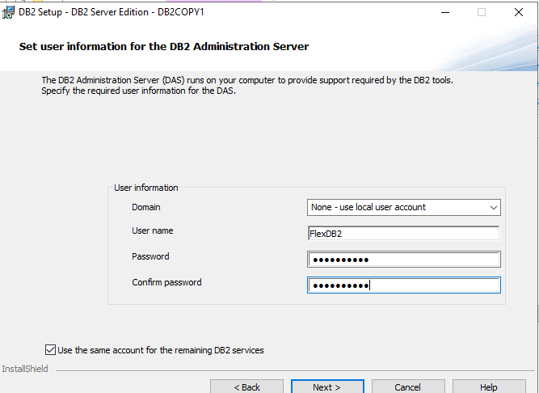
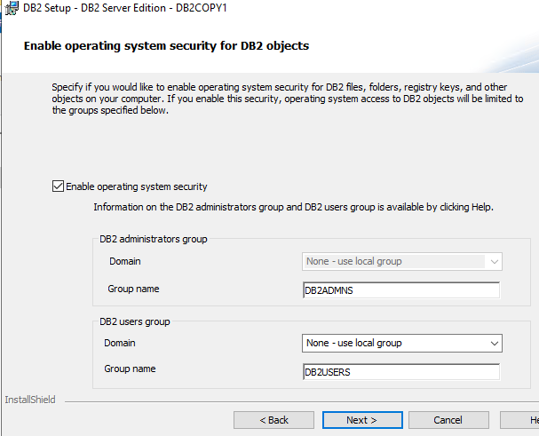
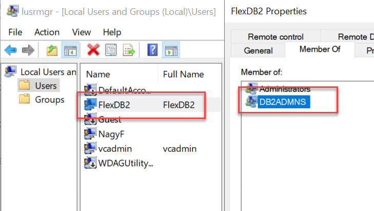
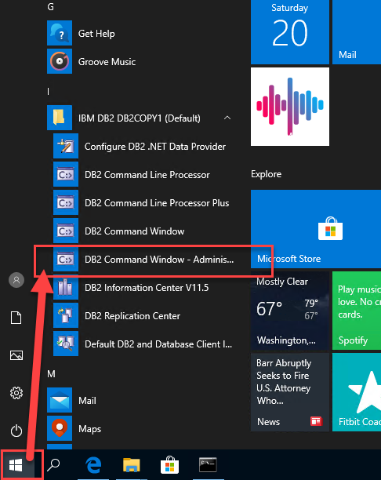
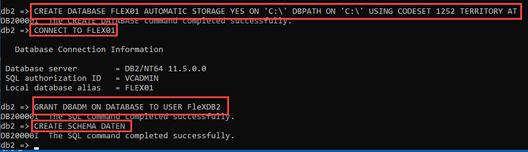

# Installieren von DB2 Server unter Windows 

Db2 Community Edition is the free edition of the Db2 for Linux / Windows database. The install image for Db2 is the same for all licenses available by IBM. You are allowed to do anything you like with Db2 Community Edition (e.g. run it in production) 

[See here...](https://www.ibmbigdatahub.com/blog/simplifying-db2-downloads-help-clients-and-developers-get-started?cm_mc_uid=81099688463915636374118&cm_mc_sid_50200000=37355781563637411813&cm_mc_sid_52640000=70284231563637411831)

IBM Db2 Community Edition 11.5, RAM: 16GB, CPU: 4 sockets or 4 cores, Database size: 100GB! No further restrictions or disabled features!
[siehe auch](https://www.kbce.com/db2-community-edition/)

also starten wir, zuerst:

### Download IBM DB2 Server 11.5.4 Community Edition

dann:

### Unzip and Start Setup (als Admin)

Windows User Verwaltung on,

...

  

...

nun ist der Server installiert

### ACHTUNG! DB2 Benutzer müssen mit Windows Userverwaltung angelegt sein
### zB: db2admin o. db2user oder wie in diese Beispiele: FlexDB2 in der Gruppe DB2ADMNS
 
  
 
### Create Database with DB2 cmdline tool
### jetzt können wir die erste Datanbank anlegen

  

Start DB2.exe

      CREATE DATABASE FLEX01 AUTOMATIC STORAGE YES ON 'C:\' DBPATH ON 'C:\' USING CODESET 1252 TERRITORY AT
      
      CONNECT TO FLEX01
    
      GRANT DBADM ON DATABASE TO USER FleXDB2

      CREATE SCHEMA DATEN
      

 
 
nun ist unsere DB2 Windows Server lauffähig,
wollen wir zugreifen muss die TCP-IP Port 50000 erreichbar sein,
bitte Firewall Regeln anpassen (TCP Port für eingehende verbindungen freigeben)

