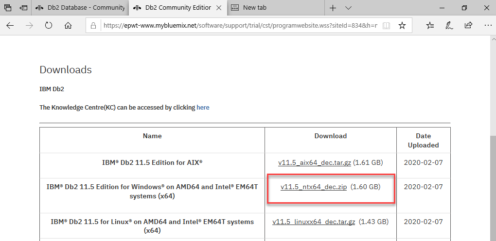

# Installieren von DB2 Server unter Windows 

### Download IBM DB2 Server 11.5 Community Edition

]

  * this one
  * that one
  * the other one

### Unzip and Start Setup

]

]  
 
 ### Create Database with DB2 cmdline tool

]  

Start DB.exe

      CREATE DATABASE FLEX01 AUTOMATIC STORAGE YES ON 'C:\' DBPATH ON 'C:\' USING CODESET 1252 TERRITORY AT
      
      CONNECT TO FLEX01
    
      GRANT DBADM ON DATABASE TO USER FleXDB2

      CREATE SCHEMA DATEN
      
]  
 
 
nun ist unsere DB2 Windows Server lauffähig,
wollen wir zugreifen muss die TCP-IP Port 50000 erreichbar sein,
bitte Firewall Regeln anpassen (Ein/Aus TCP Port freigeben)

